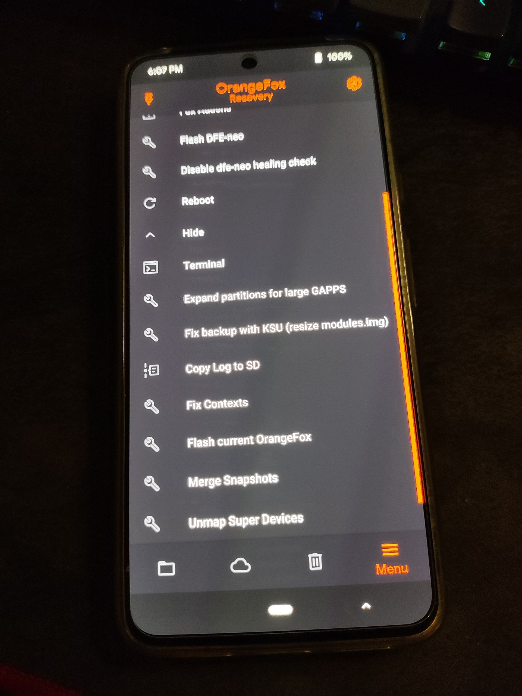

**OrangeFox Recovery for Pixel 9 Pro XL (komodo)**

**Maintainer:** LeeGarChat

**Version:** R11.3 (based on RANCH 14.1)

---

## What Works

* **MTP** (Media Transfer Protocol)
* **ADB Sideload**
* **ADB** (Android Debug Bridge)
* **Reflash Recovery** (custom code)
* **Flashing ROM**
* **Flashing ZIP files**
* **Slot Switcher** (BootControl)
* **Backup files**: Backup of the `/data` partition works when encryption is disabled. **Important:** Before backing up, make sure to remove the device lock (PIN/password/pattern). Starting from Android 15, Google has changed the way `locksettings.db` is handled, and modifying or restoring it (including deleting it) can break the system. This makes direct manipulation of device lock files potentially unsafe.

---

## Known Issues

### Major

1. **/data (userdata) decryption** : Currently not supported and likely not fixable in this build. For data access, use **DFE** (included in this build).
2. **USB Host / OTG** : Hardware limitation. Requires a DTB overlay in `dtbo`, which cannot be loaded. Modifying the DTB causes a bootloop. Using Pixel libraries does not resolve this issue, as it’s tied to DTB configuration.

### Minor

* **Flashlight** : May not work. Potentially fixable, but not yet tested.
* **Vibration** : May not work. Possibly fixable, but low priority.

---

## Build Information

* **OrangeFox Version:** R11.3
* **Base:** RANCH 14.1
* **Device:** Google Pixel 9 Pro XL (komodo) (Based on Ofox pixel 8 series)
* **Maintainer:** LeeGarChat
* **Build Date:** See Release section

---

## Installation & Releases

Please refer to the [Releases ](https://github.com/leegarchat/twrp_device_google_husky/releases)section for download links and detailed installation instructions.

---

## Photos

---

*If you encounter any other issues or have feature requests, feel free to open an issue or contact the maintainer.*
